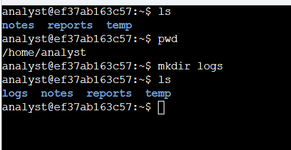
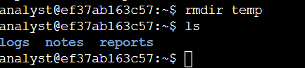
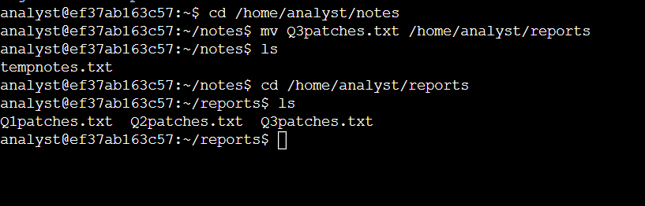
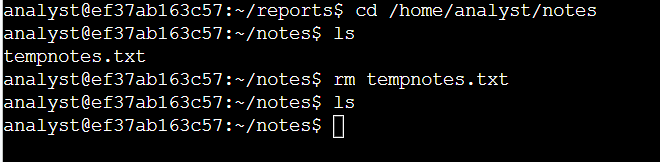
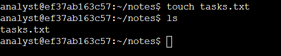
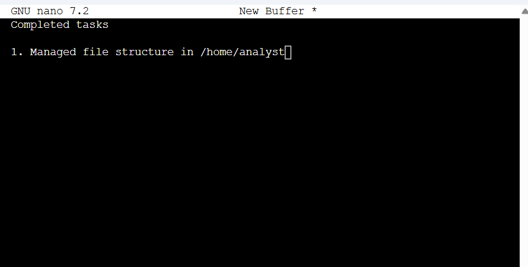
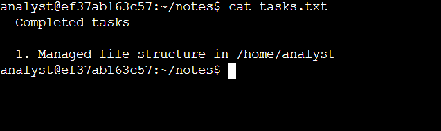

# Linux File and Directory Management Lab

## Project Overview

This project documents hands-on Linux file and directory management completed in an authorized cybersecurity training environment.

The objective was to reorganize the `/home/analyst` directory structure using Bash commands, move and remove files, create a new file, and edit that file using the Nano text editor.

The exercise reinforced how Linux administrators and security professionals manage files and directories from the command line without relying on a graphical interface.

---

## Skills Demonstrated

- Linux command-line administration
- Bash shell usage
- Directory creation
- Directory removal
- File movement
- File deletion
- File creation
- Text editing with Nano
- File verification
- Directory structure validation
- Command-line documentation

---

## Technologies and Commands

| Command / Tool | Purpose |
|---|---|
| `ls` | List files and directories |
| `pwd` | Display the current working directory |
| `mkdir` | Create a new directory |
| `rmdir` | Remove an empty directory |
| `cd` | Change the current directory |
| `mv` | Move or rename a file |
| `rm` | Remove a file |
| `touch` | Create an empty file |
| `nano` | Edit a text file from the terminal |
| `cat` | Display file contents |

---

## Environment

The activity was completed in a temporary authorized Linux training environment using the account:

```text
analyst
```

The starting directory structure was:

```text
/home/analyst
├── notes
│   ├── Q3patches.txt
│   └── tempnotes.txt
├── reports
│   ├── Q1patches.txt
│   └── Q2patches.txt
└── temp
```

The goal was to reorganize the structure to:

```text
/home/analyst
├── logs
├── notes
│   └── tasks.txt
└── reports
    ├── Q1patches.txt
    ├── Q2patches.txt
    └── Q3patches.txt
```

---

## Task 1: Create a New Directory

I first confirmed my current directory and listed its contents:

```bash
pwd
ls
```

The current directory was:

```text
/home/analyst
```

I created a new directory called `logs`:

```bash
mkdir logs
```

I then verified the new structure with:

```bash
ls
```

The output showed:

```text
logs
notes
reports
temp
```

### Result

The `logs` directory was successfully created.

---

## Task 2: Remove an Unneeded Directory

The temporary directory was no longer needed.

I removed it using:

```bash
rmdir temp
```

I verified the change with:

```bash
ls
```

The remaining directories were:

```text
logs
notes
reports
```

### Result

The empty `temp` directory was successfully removed.

---

## Task 3: Move a File

The file:

```text
Q3patches.txt
```

was located in the `notes` directory but belonged with the quarterly reports.

I navigated to:

```bash
cd /home/analyst/notes
```

and moved the file to the reports directory:

```bash
mv Q3patches.txt /home/analyst/reports
```

I then navigated to the reports directory and verified the result:

```bash
cd /home/analyst/reports
ls
```

The directory now contained:

```text
Q1patches.txt
Q2patches.txt
Q3patches.txt
```

### Result

`Q3patches.txt` was successfully moved into the correct reporting directory.

---

## Task 4: Remove an Unused File

I returned to:

```bash
cd /home/analyst/notes
```

The remaining temporary file was:

```text
tempnotes.txt
```

I removed it using:

```bash
rm tempnotes.txt
```

I verified the directory contents with:

```bash
ls
```

### Result

The unused temporary notes file was successfully deleted.

---

## Task 5: Create a New File

I created a new text file named:

```text
tasks.txt
```

using:

```bash
touch tasks.txt
```

I verified its creation with:

```bash
ls
```

The directory now contained:

```text
tasks.txt
```

### Result

The new task documentation file was successfully created.

---

## Task 6: Edit a File with Nano

I opened the new file using the Nano text editor:

```bash
nano tasks.txt
```

Inside Nano, I added:

```text
Completed tasks

1. Managed file structure in /home/analyst
```

I saved the changes and exited the editor.

I then verified the saved contents using:

```bash
cat tasks.txt
```

The terminal displayed:

```text
Completed tasks

1. Managed file structure in /home/analyst
```

### Result

The file was successfully edited and saved using Nano.

---

## Understanding the Commands

### `mkdir`

```bash
mkdir logs
```

Creates a new directory.

This can be used to organize logs, reports, configuration files, evidence, or other system data.

---

### `rmdir`

```bash
rmdir temp
```

Removes an empty directory.

Unlike `rm`, `rmdir` is specifically designed for empty directories.

---

### `mv`

```bash
mv Q3patches.txt /home/analyst/reports
```

Moves a file from one location to another.

The same command can also be used to rename files.

---

### `rm`

```bash
rm tempnotes.txt
```

Deletes a file.

Because Linux command-line deletion may not use a graphical recycle bin, commands such as `rm` should be used carefully.

---

### `touch`

```bash
touch tasks.txt
```

Creates an empty file if the file does not already exist.

It can also update file timestamps when used on an existing file.

---

### `nano`

```bash
nano tasks.txt
```

Opens the Nano command-line text editor.

Nano allows files such as notes, configuration files, scripts, and documentation to be edited directly from the terminal.

---

### `cat`

```bash
cat tasks.txt
```

Displays the contents of a file.

In this project, I used it to verify that the changes made in Nano were saved correctly.

---

## Cybersecurity Relevance

Security analysts frequently manage files and directories on Linux systems.

These skills are useful when working with:

- security logs
- incident reports
- configuration files
- patch documentation
- access-control files
- scripts
- evidence files
- temporary investigation data

Proper file organization also makes investigations more efficient and reduces the risk of working with outdated or misplaced information.

The `Q3patches.txt` example reflects a basic version of a real operational task: moving patch-related documentation into the correct reporting location.

Managing patch information is relevant to cybersecurity because missing or poorly documented patches can contribute to vulnerability-management problems.

---

## Operational Considerations

This exercise also reinforced several file-management habits that matter in security work:

- Verify the current path before modifying files.
- Use `ls` to confirm the expected files are present.
- Verify changes after moving or deleting data.
- Be cautious with destructive commands such as `rm`.
- Keep files organized according to their purpose.
- Document completed administrative changes.

A reliable workflow is:

```text
Check current location
        ↓
Inspect existing structure
        ↓
Perform one change
        ↓
Verify the change
        ↓
Continue to the next task
        ↓
Document completed work
```

---

## Evidence

The following screenshots were captured in the authorized Linux training environment.

### 1. Creating the Logs Directory

I used `mkdir` to create the new `logs` directory and verified it with `ls`.



### 2. Removing the Temporary Directory

I removed the empty `temp` directory using `rmdir`.



### 3. Moving the Q3 Patch Report

I moved `Q3patches.txt` from `notes` to `reports` and confirmed that all three quarterly reports were stored together.



### 4. Removing Temporary Notes

I removed the unused `tempnotes.txt` file and verified that it was no longer present.



### 5. Creating the Tasks File

I created `tasks.txt` with the `touch` command.



### 6. Editing with Nano

I used the Nano text editor to record the completed file-management work.



### 7. Verifying the Saved File

I used `cat` to confirm that the text entered in Nano was saved successfully.



> All evidence comes from an authorized temporary training environment. No real customer information, credentials, passwords, API keys, proprietary logs, or confidential business information are included.

---

## What I Learned

This project reinforced how several basic Linux commands can be combined to manage an organized file system.

I practiced:

- creating directories with `mkdir`
- removing empty directories with `rmdir`
- moving files with `mv`
- deleting files with `rm`
- creating files with `touch`
- editing text files with Nano
- verifying file contents with `cat`
- checking changes with `ls`
- organizing related files into appropriate locations

The most important lesson was that file management should include verification.

After each major change, I checked the resulting directory or file contents rather than assuming the command completed as intended.

---

## Lab Outcome

| Objective | Result |
|---|---|
| Create `logs` directory | ✅ Completed |
| Remove `temp` directory | ✅ Completed |
| Move `Q3patches.txt` | ✅ Completed |
| Remove `tempnotes.txt` | ✅ Completed |
| Create `tasks.txt` | ✅ Completed |
| Edit file with Nano | ✅ Completed |
| Verify saved file contents | ✅ Completed |

---

## Project Status

**Completed**

This project demonstrates foundational Linux file and directory management using the Bash shell and Nano text editor.