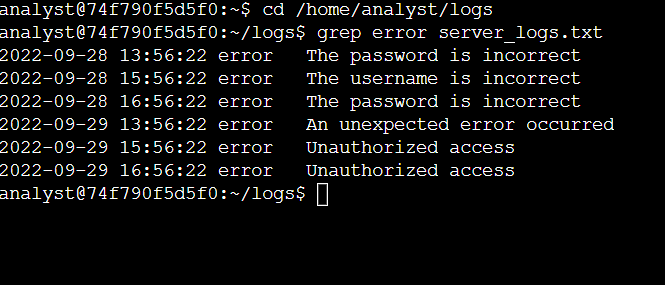
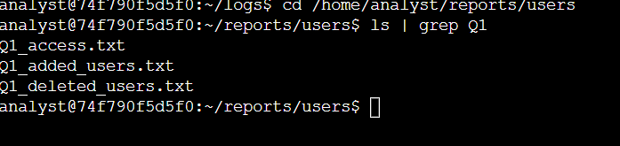
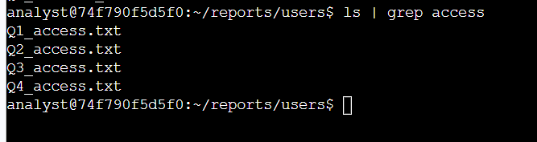
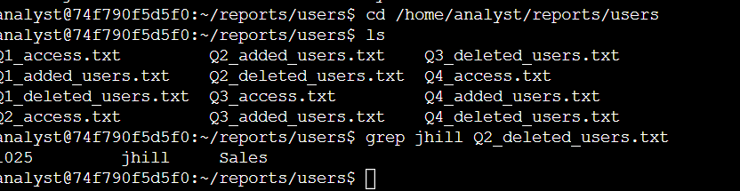
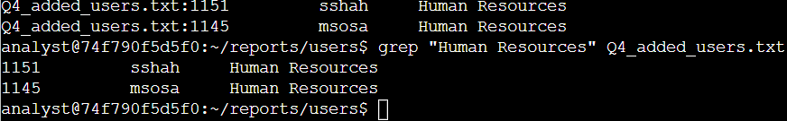

# Linux Filtering with grep

## Project Overview

This project documents hands-on Linux filtering and search practice completed in an authorized cybersecurity training environment.

The objective was to use `grep` and command piping in Bash to locate specific information within server logs, identify files matching naming patterns, and search user-account records.

The exercise moved beyond simply displaying file contents by using filters to reduce larger sets of information to only the records relevant to an investigation.

---

## Skills Demonstrated

- Linux command-line navigation
- Bash shell usage
- `grep`
- Command piping with `|`
- Log filtering
- File-name filtering
- User-account record searches
- Multi-word string searches
- Error interpretation
- Command syntax troubleshooting
- Basic security log analysis

---

## Technologies and Commands

| Command / Feature | Purpose |
|---|---|
| `cd` | Navigate between directories |
| `ls` | List files in a directory |
| `grep` | Search text for matching patterns |
| `|` | Pipe output from one command into another command |
| Quotation marks | Treat multi-word text as one search pattern |

---

## Environment

The activity was completed in a temporary authorized Linux training environment using the Bash shell.

The provided training account was:

```text
analyst
```

All files and logs used in this project were simulated training data.

---

# Task 1: Filter Error Messages from a Server Log

I navigated to the log directory:

```bash
cd /home/analyst/logs
```

I then filtered `server_logs.txt` for lines containing the word `error`:

```bash
grep error server_logs.txt
```

The command returned only entries containing the requested string.

The results included authentication and application-related errors such as:

```text
The password is incorrect
The username is incorrect
An unexpected error occurred
Unauthorized access
```

### Result

The log contained:

```text
6 error entries
```

Instead of manually reading the entire log file, `grep` reduced the output to only the records relevant to the investigation.

---

# Task 2: Filter File Names with a Pipe

I navigated to:

```bash
cd /home/analyst/reports/users
```

The directory contained several quarterly user reports.

Rather than manually reviewing every filename, I combined `ls` and `grep`.

## Locate Q1 Files

I ran:

```bash
ls | grep Q1
```

The pipe character:

```text
|
```

sent the output generated by `ls` into `grep`.

The filtered results were:

```text
Q1_access.txt
Q1_added_users.txt
Q1_deleted_users.txt
```

### Result

There were:

```text
3 files
```

containing `Q1` in their names.

---

## Locate Access Reports

I then searched the filenames for:

```text
access
```

using:

```bash
ls | grep access
```

The output returned:

```text
Q1_access.txt
Q2_access.txt
Q3_access.txt
Q4_access.txt
```

### Result

There were:

```text
4 access report files
```

---

# Task 3: Search User Records

The next investigation involved searching inside user-account files rather than filtering filenames.

## Search for a Deleted User

I searched the Q2 deleted-user report for the username `jhill`:

```bash
grep jhill Q2_deleted_users.txt
```

The matching record was returned:

```text
1025    jhill    Sales
```

### Finding

The user `jhill` was present in the Q2 deleted-user report.

This demonstrates how `grep` can be used to quickly determine whether a particular account appears in an access-management record.

---

# Searching a Multi-Word Department Name

I also needed to identify users added to the Human Resources department during Q4.

My first attempt did not correctly group the two-word department name.

Without quotation marks, Bash and `grep` interpreted the input as separate arguments instead of one search string.

The command produced an error indicating that `Resources` was being interpreted incorrectly.

This demonstrated why strings containing spaces must be handled carefully in the shell.

---

## Corrected Search

I corrected the search by enclosing the department name in quotation marks:

```bash
grep "Human Resources" Q4_added_users.txt
```

The output returned:

```text
1151    sshah    Human Resources
1145    msosa    Human Resources
```

### Result

Two users were added to the Human Resources department during Q4.

---

# Understanding grep

`grep` searches input for lines containing a specified pattern.

For example:

```bash
grep error server_logs.txt
```

means:

> Search `server_logs.txt` and return lines containing `error`.

Instead of reading every line manually, an analyst can immediately narrow the output to relevant events.

---

# Understanding Pipes

The pipe operator:

```text
|
```

connects two commands.

For example:

```bash
ls | grep access
```

works as:

```text
ls
 ↓
produces filenames
 ↓
|
 ↓
grep access
 ↓
returns only filenames containing "access"
```

This allows multiple Linux commands to be combined into a simple investigation workflow.

---

# Why Quotation Marks Matter

The search:

```bash
grep "Human Resources" Q4_added_users.txt
```

uses quotation marks because the pattern contains a space.

Without the quotation marks, the shell separates:

```text
Human
```

and:

```text
Resources
```

into different command arguments.

This exercise reinforced that Bash processes command syntax before passing arguments to programs such as `grep`.

---

# Cybersecurity Relevance

Filtering is an important skill for cybersecurity analysts because security datasets can contain thousands or millions of records.

Analysts frequently need to reduce that information to specific events such as:

- failed logins
- authentication errors
- unauthorized-access messages
- specific usernames
- user-account changes
- IP addresses
- suspicious processes
- particular dates or timestamps
- indicators of compromise

For example:

```bash
grep error server_logs.txt
```

is a simple version of the same general process used when analysts filter much larger security logs.

The user-report portion of the exercise also connects to identity and access management.

Commands such as:

```bash
grep jhill Q2_deleted_users.txt
```

can help determine whether a user appears in an account-change report.

---

# Investigation Workflow

This exercise demonstrated a basic analyst workflow:

```text
Locate relevant directory
        ↓
Identify available data
        ↓
Choose a search pattern
        ↓
Filter the data
        ↓
Review matching records
        ↓
Interpret the results
```

This is more efficient than manually reviewing every record.

---

# Evidence

The following screenshots were captured in the authorized Linux training environment.

## 1. Filtering Server Errors

I used `grep` to return only error entries from the server log.



---

## 2. Filtering Q1 File Names

I piped the output from `ls` into `grep` to locate files containing `Q1`.



---

## 3. Filtering Access Report Files

I filtered filenames for the string `access`.



---

## 4. Searching for a Specific User

I searched the deleted-user report for `jhill`.



---

## 5. Multi-Word Search Error

My initial department search demonstrated how an unquoted multi-word pattern can be interpreted incorrectly.


---

## 6. Corrected Multi-Word Search

I corrected the command by quoting `"Human Resources"` and successfully returned both matching users.



> All evidence comes from an authorized temporary training environment. No real customer information, credentials, passwords, API keys, or proprietary logs are included.

---

# What I Learned

This activity moved my Linux practice from simply navigating and reading files toward efficiently searching larger collections of information.

I learned how to:

- filter log entries with `grep`
- search for specific usernames
- filter filenames
- combine commands with pipes
- understand standard output flowing between commands
- search multi-word strings using quotation marks
- interpret command errors
- correct Bash syntax
- extract specific information instead of manually reviewing entire files

The most useful lesson was seeing how small Linux commands can be combined to turn a large amount of data into a much smaller, investigation-focused result.

---

# Lab Outcome

| Objective | Result |
|---|---|
| Filter error messages from a log | ✅ Completed |
| Identify Q1 files | ✅ Completed |
| Identify access-report files | ✅ Completed |
| Search for a specific user | ✅ Completed |
| Search a multi-word department name | ✅ Completed |
| Use command piping | ✅ Completed |
| Troubleshoot incorrect search syntax | ✅ Completed |

---

# Project Status

**Completed**

This project demonstrates foundational Linux filtering techniques that can be applied to security logs, user-account records, and other text-based investigation data.