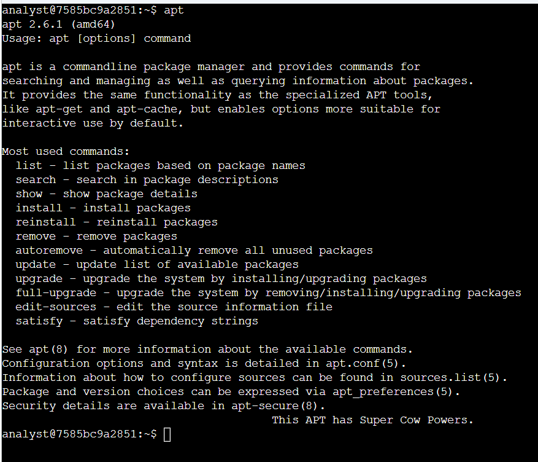
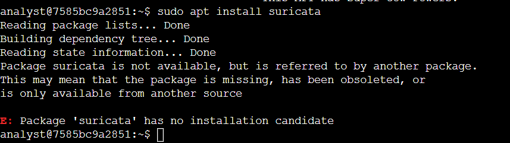
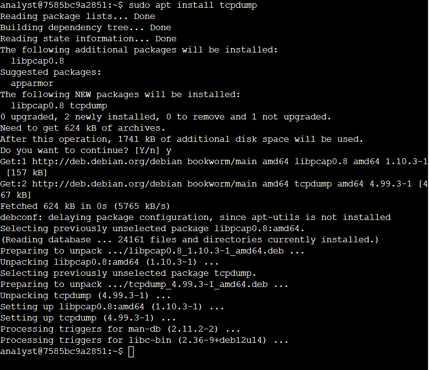
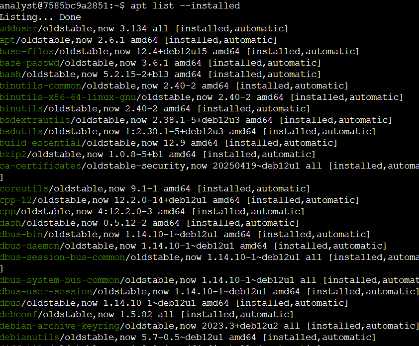

# Linux Software Management Lab

## Project Overview

This project documents hands-on Linux package-management practice completed in an authorized Debian-based Qwiklabs training environment as part of my cybersecurity studies.

The objective of the lab was to use the Bash shell, `sudo`, and the Advanced Package Tool (APT) to manage security-related software. The planned activities included installing, removing, and verifying Suricata and tcpdump.

During the exercise, I successfully confirmed the APT environment, installed tcpdump and its dependency, queried installed packages, and investigated a reproducible package-availability issue that prevented Suricata from being installed in the provided virtual machine.

The Suricata issue could not be resolved from within the student environment and was escalated to the training platform's technical support team.

---

## Skills Demonstrated

- Linux command-line navigation
- Bash shell usage
- Debian package management
- APT
- `sudo` and elevated privileges
- Software installation
- Package dependency awareness
- Installed-package verification
- Command-line troubleshooting
- Error-message interpretation
- Problem isolation
- Technical documentation
- Issue escalation
- Security-tool familiarity

---

## Technologies and Tools

| Technology | Purpose |
|---|---|
| Linux | Operating system used in the lab environment |
| Debian | Linux distribution family used by the virtual machine |
| Bash | Command-line shell used to execute commands |
| APT | Debian package-management utility |
| sudo | Executes authorized commands with elevated privileges |
| tcpdump | Command-line network packet capture and analysis tool |
| Suricata | Network security monitoring and intrusion detection tool |
| Qwiklabs | Authorized virtual training environment |

---

## Environment

The exercise was completed using the provided temporary Linux virtual machine.

Using an isolated training environment allowed Linux administration and cybersecurity tools to be practiced without interacting with production systems or third-party infrastructure.

The logged-in lab account was:

```text
analyst
```

The environment used a Debian-based Linux distribution and APT for package management.

---

## Task 1: Confirm APT Availability

I first confirmed that the APT package manager was available by running:

```bash
apt
```

APT returned its version and command information:

```text
apt 2.6.1 (amd64)
Usage: apt [options] command
```

The output also displayed available operations such as:

```text
list
search
show
install
reinstall
remove
autoremove
update
upgrade
```

### Result

APT was installed and responding correctly.

This established that the package-management utility itself was available before attempting to install additional software.

---

## Task 2: Attempt to Install Suricata

The next objective was to install Suricata using:

```bash
sudo apt install suricata
```

The command used `sudo` because installing system software requires elevated privileges.

Instead of installing the package, APT returned:

```text
Package suricata is not available, but is referred to by another package.
This may mean that the package is missing, has been obsoleted, or
is only available from another source

E: Package 'suricata' has no installation candidate
```

### Result

Suricata could not be installed in the provided virtual machine.

Because the package had no installation candidate, I could not proceed with the planned Suricata verification, removal, or reinstallation steps.

---

## Troubleshooting the Suricata Failure

Rather than assuming that the command syntax was incorrect, I investigated whether the problem was caused by my command, APT, the browser session, or the provided training environment.

### Troubleshooting steps

I:

1. Confirmed that APT was installed and responding normally.
2. Verified that the required command syntax was:

   ```bash
   sudo apt install suricata
   ```

3. Closed and restarted the training lab.
4. Cleared the browser cache.
5. Retried the exercise using a clean Chrome Incognito session.
6. Repeated the Suricata installation attempt in newly started lab sessions.
7. Successfully installed another package, tcpdump, using the same APT package manager.
8. Confirmed that package queries also worked normally.
9. Reproduced the Suricata error across multiple attempts.

### Analysis

The successful installation of tcpdump demonstrated that:

- APT itself was functioning.
- The lab had access to the configured Debian package repository.
- Package downloads could complete.
- Software could be installed using elevated privileges.

Suricata, however, consistently returned:

```text
E: Package 'suricata' has no installation candidate
```

This narrowed the likely cause to package availability or repository configuration within the provided lab environment rather than a general failure of APT.

Because repository configuration for the managed training environment was outside the scope of the student account, I documented the issue and escalated it to technical support.

### Escalation

I reported that the Suricata installation repeatedly failed even after restarting the lab and retrying from a clean browser session.

The issue was escalated to the training platform's technical team so that the virtual-machine or repository configuration could be investigated.

---

## Task 3: Install tcpdump

I then installed tcpdump using:

```bash
sudo apt install tcpdump
```

APT calculated the required packages and reported that the following packages would be installed:

```text
libpcap0.8
tcpdump
```

The output showed:

```text
The following NEW packages will be installed:
  libpcap0.8 tcpdump
```

APT downloaded approximately 624 KB of package data and completed the installation.

The output included:

```text
Setting up libpcap0.8:amd64
Setting up tcpdump
```

### Result

tcpdump installed successfully.

This exercise also demonstrated how Linux package managers automatically resolve and install dependencies required by another application.

In this case, tcpdump required the `libpcap0.8` package.

---

## Task 4: Query Installed Packages

To inspect the software installed in the environment, I ran:

```bash
apt list --installed
```

APT returned a long list of installed packages and their versions.

Examples included system packages such as:

```text
apt
base-files
bash
binutils
coreutils
dbus
```

This command can be used to verify whether required software is installed and to inspect installed package versions.

### Result

The installed-package query completed successfully.

This provided additional confirmation that the package-management system was functioning despite the separate Suricata availability problem.

---

## Commands Practiced

```bash
apt
```

Displays APT usage information and confirms that the package-management utility is available.

```bash
sudo apt install suricata
```

Attempts to install the Suricata package using elevated privileges.

```bash
sudo apt install tcpdump
```

Installs tcpdump and any required dependencies.

```bash
apt list --installed
```

Lists packages currently installed in the Linux environment.

---

## Key Concepts Reinforced

### APT

APT stands for **Advanced Package Tool**.

It is used by Debian-based Linux systems to install, remove, update, and query software packages.

Instead of manually locating every file an application needs, the package manager can identify and install required dependencies.

### sudo

`sudo` allows an authorized user to execute a command with elevated privileges.

Software installation modifies system-level resources, so commands such as:

```bash
apt install
```

commonly require `sudo`.

### Dependencies

A dependency is another software component required for an application to work.

When tcpdump was installed, APT also installed:

```text
libpcap0.8
```

APT handled this dependency automatically.

### Package Repository

APT retrieves packages from configured software repositories.

An error stating that a package has **no installation candidate** can indicate that the requested package is unavailable through the repositories configured for that system.

---

## Cybersecurity Relevance

Linux is widely used for servers, cloud infrastructure, cybersecurity tools, and security monitoring systems.

Security professionals need to understand how to manage applications from the command line because tools used for activities such as network monitoring, packet analysis, logging, and threat detection may need to be installed, updated, verified, or removed.

The two security tools involved in this exercise illustrate this connection:

### tcpdump

tcpdump is a command-line packet capture and network traffic analysis utility.

Security analysts can use packet data to investigate network communication and troubleshoot suspicious or unexpected network behavior.

### Suricata

Suricata is a network security monitoring and intrusion detection tool.

Although I could not install it because of the package availability issue in the provided environment, troubleshooting the failure provided additional practice interpreting Linux package-management errors and isolating the likely source of a technical problem.

---

## What I Learned

This exercise reinforced that Linux administration is not simply about memorizing commands.

I practiced interpreting what the operating system returned after each command and using that information to determine what happened.

I learned how to:

- Confirm that a Linux package manager is available.
- Use APT to install software.
- Understand why system-level package installation requires elevated privileges.
- Recognize that package installations may require dependencies.
- Query software installed on a Linux system.
- Interpret APT output and error messages.
- Distinguish between a command problem and an environment or repository problem.
- Reproduce a technical problem before escalating it.
- Document the troubleshooting steps already attempted.
- Escalate an issue when the underlying infrastructure is outside my administrative control.

One of the most useful lessons from this exercise was that troubleshooting does not always end with personally fixing the problem.

In a real IT or cybersecurity environment, an analyst may determine that an issue belongs to another system or team. In that situation, gathering evidence, narrowing the likely cause, documenting reproduction steps, and escalating clearly are part of resolving the incident.

---

## Evidence Collected

The following screenshots were captured in the authorized Linux training environment and document the commands, results, and troubleshooting performed during this project.

### 1. Confirming APT Availability

Running `apt` confirmed that the Advanced Package Tool was installed and available in the Debian-based environment.



### 2. Suricata Installation Error

The required Suricata installation command returned `Package 'suricata' has no installation candidate`. This error was reproduced across multiple lab attempts and became the focus of the troubleshooting portion of this project.



### 3. Successful tcpdump Installation

The installation of tcpdump completed successfully. APT also identified and installed the required `libpcap0.8` dependency.



### 4. Installed Package Query

I used `apt list --installed` to inspect the packages available in the Linux environment and practice verifying installed software.



> All evidence shown comes from a temporary authorized training environment. No real customer information, passwords, credentials, API keys, proprietary logs, or confidential business data are included.

---

## Lab Outcome

| Objective | Result |
|---|---|
| Confirm APT availability | ✅ Completed |
| Attempt Suricata installation | ✅ Attempted |
| Install Suricata | ⚠️ Blocked by lab package availability |
| Verify Suricata | ⚠️ Could not complete because installation was blocked |
| Remove Suricata | ⚠️ Could not complete because installation was blocked |
| Install tcpdump | ✅ Completed |
| Inspect installed packages | ✅ Completed |
| Reinstall Suricata | ⚠️ Could not complete because installation was blocked |
| Troubleshoot environment issue | ✅ Completed |
| Escalate unresolved issue | ✅ Completed |

---

## Project Status

**Completed to the extent supported by the provided training environment.**

The Linux package-management, tcpdump installation, package-query, troubleshooting, and escalation portions were completed successfully.

The Suricata installation lifecycle could not be completed because the provided lab environment did not expose an installation candidate for the required package.

The issue was documented and escalated to the training platform's technical support team.