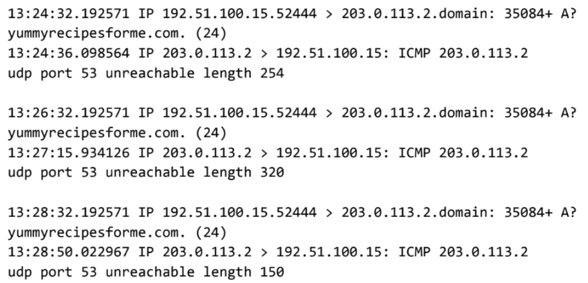

# DNS and ICMP Network Traffic Analysis

## Project Overview

This project documents a network traffic investigation completed in an authorized cybersecurity training environment.

The objective was to analyze packet data from `tcpdump`, determine why users could not access a website, identify the network protocols involved, and document the findings in an incident report.

The investigation involved DNS, UDP, ICMP, port 53, IP addressing, packet-flow interpretation, and incident troubleshooting.

---

## Skills Demonstrated

- Network traffic analysis
- tcpdump log interpretation
- DNS troubleshooting
- UDP protocol analysis
- ICMP error interpretation
- TCP/IP model fundamentals
- Source and destination IP analysis
- Network port identification
- Incident documentation
- Root-cause hypothesis development
- Evidence-based troubleshooting
- Separating observed evidence from assumptions
- Technical escalation and next-step planning

---

## Technologies and Protocols

| Technology / Protocol | Role in the Investigation |
|---|---|
| tcpdump | Network protocol analyzer used to inspect packet traffic |
| DNS | Resolves domain names to IP addresses |
| UDP | Transport protocol used for the observed DNS requests |
| ICMP | Reported the destination/port unreachable condition |
| Port 53 | Standard port associated with DNS |
| IP | Identified source and destination systems involved in the traffic |

---

## Scenario

Users reported that they were unable to access a company website and received a **destination port unreachable** error.

To investigate the issue, the problem was reproduced while network traffic was examined using `tcpdump`.

The browser attempted to resolve the website's domain name by sending DNS queries over UDP to a DNS server on port 53.

Instead of receiving normal DNS responses, the client received ICMP messages stating that UDP port 53 was unreachable.

Because DNS resolution could not complete, the browser could not obtain the destination IP address required to continue connecting to the website.

---

## Investigation Summary

The packet capture showed the following sequence:

```text
Client
  |
  | UDP DNS query
  | Destination: DNS server, port 53
  v
DNS Server
  |
  | ICMP response
  | "UDP port 53 unreachable"
  v
Client
```

The first recorded event occurred at approximately **1:24 PM**.

The repeated ICMP responses indicated that the client's DNS queries were not being accepted by the DNS service. :contentReference[oaicite:0]{index=0}

---

## Key Findings

- The client attempted to send DNS queries using UDP.
- The destination was the DNS server on port 53.
- The DNS server did not return a normal DNS response.
- The client instead received ICMP messages stating that UDP port 53 was unreachable.
- DNS resolution therefore could not complete.
- Without successful DNS resolution, the browser could not obtain the IP address required to continue to the website.
- The available packet evidence does not establish that the incident was caused by malicious activity. :contentReference[oaicite:1]{index=1}

---

## Likely Cause

Based on the available evidence, the most likely cause was that the DNS service on UDP port 53 was unavailable or not listening for requests.

Other possibilities that should be investigated include:

- DNS service misconfiguration
- DNS server availability problems
- Firewall rules affecting UDP port 53
- Network access-control configuration
- Other infrastructure issues affecting DNS traffic

The packet capture alone does not prove which of these conditions caused the outage. :contentReference[oaicite:2]{index=2}

---

## Recommended Next Steps

1. Verify that the DNS service is running.
2. Confirm that the DNS service is listening on UDP port 53.
3. Review DNS server configuration.
4. Review DNS server logs.
5. Check firewall and network access-control rules affecting DNS traffic.
6. Retest DNS resolution after remediation.
7. Confirm that the website becomes reachable once DNS resolution succeeds. :contentReference[oaicite:3]{index=3}

---

## Analyst Reasoning

An important part of this investigation was separating **observed evidence** from **possible causes**.

### Observed Evidence

```text
UDP DNS requests → port 53
ICMP response → UDP port 53 unreachable
```

### Supported Conclusion

DNS resolution was failing because the DNS service was not reachable on UDP port 53.

### Hypotheses Requiring Additional Evidence

The service could have been stopped, misconfigured, blocked by a firewall, or affected by another infrastructure problem.

The packet capture did not provide enough evidence to conclude that a cyberattack caused the failure.

---

## Evidence

The packet data analyzed in this project was provided as part of an authorized cybersecurity training scenario.

### Packet Capture



### Raw Packet Data

[View the tcpdump log](evidence/tcpdump-log.txt)

The packet data shows repeated DNS queries sent from the client to the DNS server over UDP port 53, followed by ICMP responses reporting that UDP port 53 was unreachable.

Example traffic from the provided training artifact:

```text
13:24:32.192571 IP 192.51.100.15.52444 > 203.0.113.2.domain: 35084+ A? yummyrecipesforme.com. (24)
13:24:36.098564 IP 203.0.113.2 > 192.51.100.15: ICMP 203.0.113.2 udp port 53 unreachable length 254
```

The same pattern occurred repeatedly in the capture, reinforcing that the DNS requests were not receiving normal DNS responses. :contentReference[oaicite:4]{index=4}

> **Source note:** This is simulated training data provided for an authorized cybersecurity exercise. It is not production or customer network traffic.

---

## Cybersecurity Relevance

Network analysts and security analysts frequently use packet data to determine where communication is failing.

Understanding the relationship between DNS, UDP, ICMP, ports, and IP addresses helps analysts troubleshoot:

- service outages
- network misconfigurations
- firewall problems
- suspicious traffic
- failed connections
- potential security incidents

This exercise reinforced that analysts should base conclusions on observable evidence and avoid attributing an outage to malicious activity until the evidence supports that conclusion.

---

## Incident Report

A detailed analyst-style incident report is available here:

[View the Incident Report](incident-report.md)

The report documents:

- the initial user-reported symptoms
- packet-analysis findings
- protocols involved
- the suspected cause
- investigation status
- recommended troubleshooting steps
- analyst conclusions

---

## What I Learned

This project reinforced several networking and incident-analysis concepts:

- DNS commonly uses port 53.
- DNS queries may use UDP.
- ICMP can report network communication errors.
- Packet captures can reveal where a connection fails.
- A failed DNS lookup can prevent a browser from progressing to the web server.
- Analysts should distinguish between evidence, supported conclusions, and hypotheses.
- A technical error does not automatically indicate malicious activity.
- Incident reports should document findings clearly enough for another technical team to continue the investigation.

The most valuable lesson was learning to avoid jumping from an unusual network condition directly to a security-attack conclusion without sufficient evidence.

---

## Project Files

```text
tcpdump-dns-icmp-incident/
├── README.md
├── incident-report.md
└── evidence/
    ├── tcpdump-dns-icmp-log.png
    └── tcpdump-log.txt
```

---

## Project Status

**Completed**

This project was completed in an authorized cybersecurity training environment using simulated network data.

No real customer information, credentials, production systems, or proprietary network logs are included.