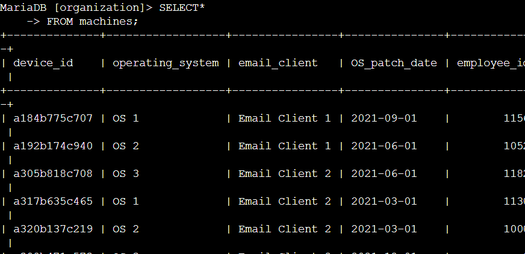
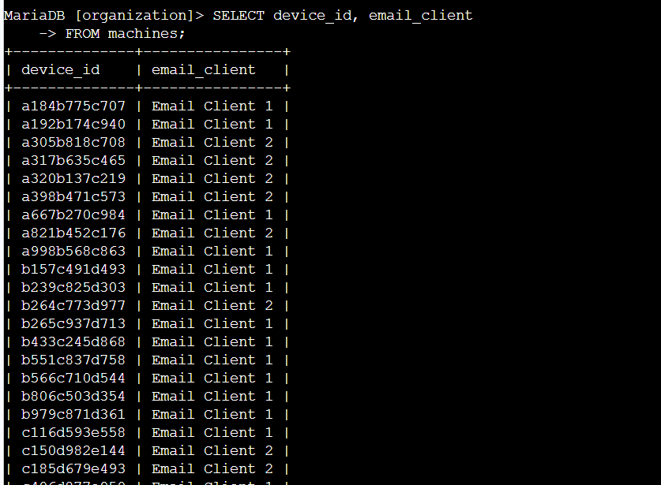
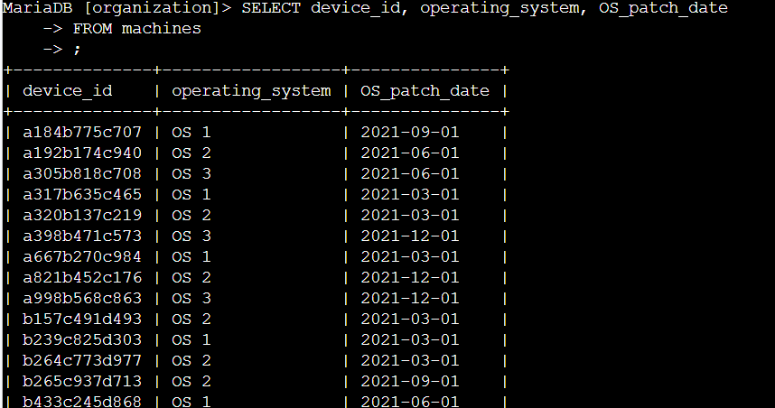
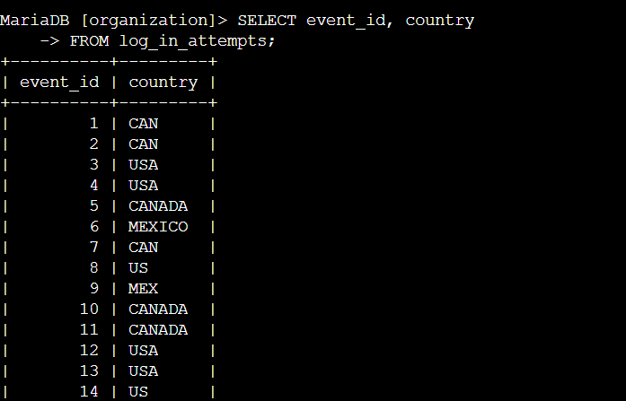
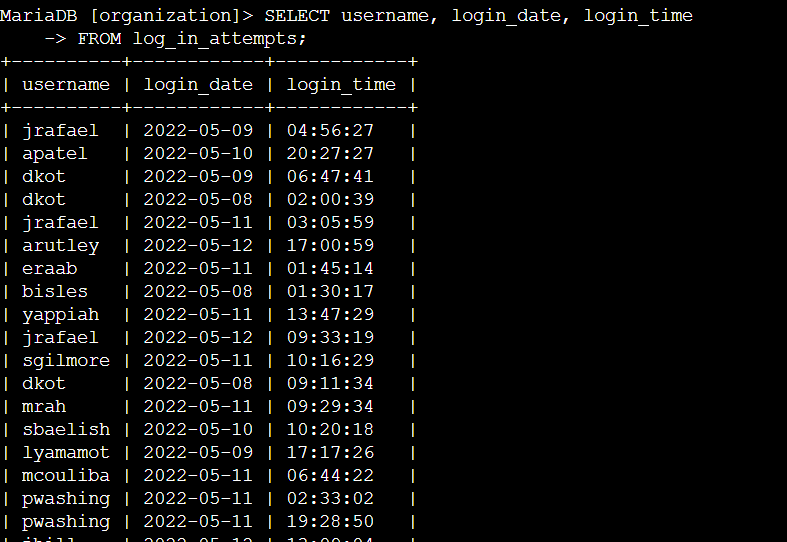
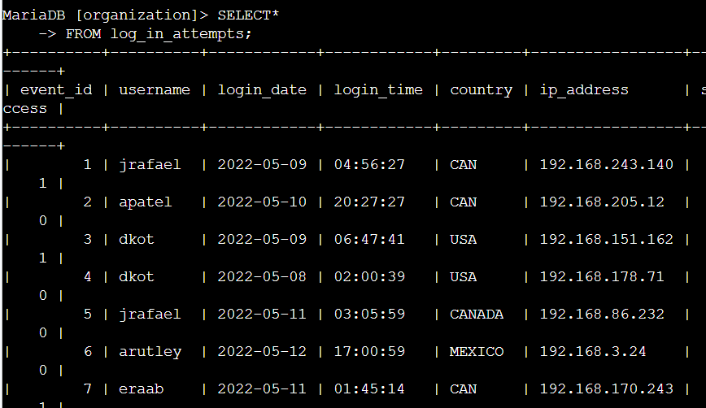
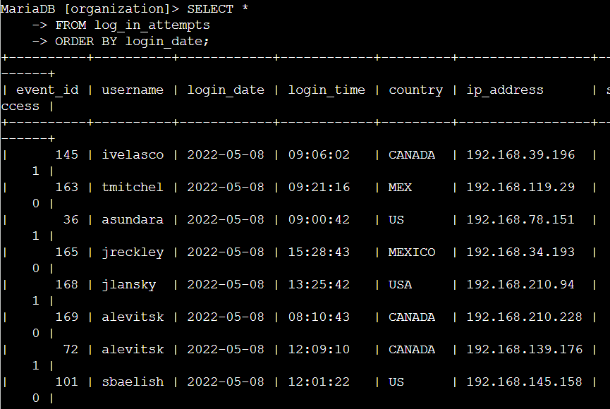
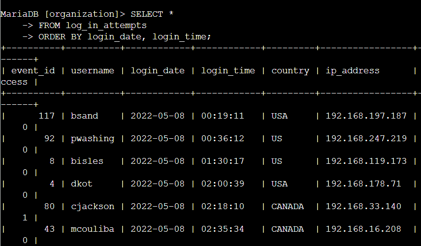

# SQL Security Queries Lab

## Project Overview

This project documents hands-on SQL practice completed in an authorized cybersecurity training environment using MariaDB.

The objective was to query employee device information and login activity from an organizational database using `SELECT`, `FROM`, and `ORDER BY`.

The exercise focused on retrieving only the information needed for a security investigation and organizing query results so that potentially relevant patterns are easier to review.

---

## Skills Demonstrated

- SQL fundamentals
- MariaDB
- `SELECT`
- `FROM`
- Selecting specific columns
- Selecting all columns with `*`
- `ORDER BY`
- Multi-column sorting
- Device inventory review
- Patch-date review
- Login activity analysis
- Security-focused data interpretation

---

## Environment

The activity was completed in a temporary authorized training environment using the `organization` database.

Two primary tables were used:

### `machines`

```text
device_id
operating_system
email_client
OS_patch_date
employee_id
```

### `log_in_attempts`

```text
event_id
username
login_date
login_time
country
ip_address
success
```

All data used in this project is simulated training data.

---

# Task 1: Retrieve Device Information

I first retrieved all records from the `machines` table:

```sql
SELECT *
FROM machines;
```

The asterisk:

```text
*
```

means that all columns in the table should be returned.

This gave me a complete view of the available device inventory.

---

## Selecting Specific Columns

Instead of returning every column, I narrowed the result to only:

```text
device_id
email_client
```

using:

```sql
SELECT device_id, email_client
FROM machines;
```

This demonstrated that SQL queries can return only the fields relevant to an investigation.

### Observation

The third row used:

```text
Email Client 2
```

---

## Reviewing Operating Systems and Patch Dates

I then queried:

```sql
SELECT device_id, operating_system, OS_patch_date
FROM machines;
```

The first returned patch date was:

```text
2021-09-01
```

### Security Relevance

Patch dates can help analysts identify devices that may require further review.

An older patch date does not automatically prove that a system is vulnerable, but it can indicate that the device should be checked for missing security updates or outdated software.

This type of query could help prioritize devices for patch-management review.

---

# Task 2: Investigate Login Activity

The next portion of the activity involved reviewing login data.

## Login Locations

I selected:

```text
event_id
country
```

using:

```sql
SELECT event_id, country
FROM log_in_attempts;
```

This allowed the geographic source associated with each login attempt to be reviewed.

### Security Relevance

Unexpected geographic activity can be one indicator of suspicious authentication behavior.

However, location alone is not enough to determine that an account has been compromised.

An analyst would normally compare the location against:

- the user's expected location
- travel activity
- VPN usage
- historical login behavior
- device information
- other authentication events

---

## Login Dates and Times

I queried:

```sql
SELECT username, login_date, login_time
FROM log_in_attempts;
```

This returned authentication activity associated with individual users.

### Security Relevance

Login timestamps can help identify behavior that differs from an established baseline.

For example, a login occurring at an unusual hour may deserve additional investigation if that time is inconsistent with the employee's normal activity.

A single late-night login by itself does not prove that an account is compromised.

---

## Retrieve Complete Login Records

I also retrieved all columns from the table:

```sql
SELECT *
FROM log_in_attempts;
```

This provided the complete record for each login attempt, including:

```text
event_id
username
login_date
login_time
country
ip_address
success
```

This broader view provides more context than reviewing a single field in isolation.

---

# Task 3: Sort Login Activity

I used `ORDER BY` to organize login records chronologically.

First:

```sql
SELECT *
FROM log_in_attempts
ORDER BY login_date;
```

This sorted the results by date.

---

## Multi-Column Sorting

I then expanded the query:

```sql
SELECT *
FROM log_in_attempts
ORDER BY login_date, login_time;
```

SQL first sorts the records by:

```text
login_date
```

and then sorts records with the same date by:

```text
login_time
```

This produces a chronological sequence of authentication activity.

### Why This Matters

Chronological ordering can help an analyst reconstruct activity during an investigation.

For example, login events could be reviewed alongside:

- failed authentications
- account changes
- endpoint alerts
- network activity
- application access
- incident timestamps

---

# Understanding the SQL Commands

## `SELECT`

```sql
SELECT device_id
```

Specifies which column or columns should be returned.

---

## `FROM`

```sql
FROM machines;
```

Specifies which table contains the requested data.

---

## `*`

```sql
SELECT *
```

Returns all columns from the selected table.

This is useful for exploration, although analysts often select only the fields they actually need.

---

## `ORDER BY`

```sql
ORDER BY login_date;
```

Sorts the query results by a specified column.

Multiple columns can also be used:

```sql
ORDER BY login_date, login_time;
```

---

# Investigation Workflow

This lab demonstrated a basic SQL investigation process:

```text
Identify the question
        ↓
Choose the relevant table
        ↓
Select the required columns
        ↓
Review the returned records
        ↓
Sort the data when needed
        ↓
Interpret the results in context
```

The goal is not simply to retrieve data, but to retrieve the data that helps answer a security question.

---

# Cybersecurity Relevance

Security analysts frequently work with structured data stored in databases, data warehouses, SIEM platforms, and security tools.

SQL can help analysts investigate:

- authentication events
- account activity
- endpoint inventories
- patch status
- geographic login patterns
- failed and successful logins
- suspicious IP addresses
- user activity
- security incidents

The queries in this project are foundational.

Later queries can use filtering conditions such as `WHERE` to reduce large datasets to only the records relevant to an investigation.

---

# Evidence

## 1. Retrieve Complete Device Inventory



---

## 2. Select Device and Email Client



---

## 3. Review Operating System Patch Dates



---

## 4. Review Login Locations



---

## 5. Review Login Dates and Times



---

## 6. Retrieve Complete Login Records



---

## 7. Sort Login Attempts by Date



---

## 8. Sort Login Attempts by Date and Time



> All screenshots come from an authorized cybersecurity training environment using simulated data. No real customer, employee, credential, or production information is included.

---

# What I Learned

This project introduced the foundations of using SQL for cybersecurity investigations.

I practiced:

- retrieving all records from a table
- selecting specific columns
- working with multiple columns
- understanding the difference between a table and a column
- sorting records using `ORDER BY`
- sorting by multiple columns
- reviewing device inventory information
- reviewing authentication activity
- interpreting data within a security context

One important lesson was that unusual data should be treated as an indicator for further investigation rather than immediate proof of malicious activity.

---

# Lab Outcome

| Objective | Result |
|---|---|
| Query the `machines` table | ✅ Completed |
| Select all device information | ✅ Completed |
| Select specific device columns | ✅ Completed |
| Review patch-date information | ✅ Completed |
| Query login locations | ✅ Completed |
| Query login timestamps | ✅ Completed |
| Retrieve complete login records | ✅ Completed |
| Sort records by date | ✅ Completed |
| Sort records by date and time | ✅ Completed |

---

# Project Status

**Completed**

This project demonstrates foundational SQL querying and sorting skills applied to simulated cybersecurity device and authentication data.